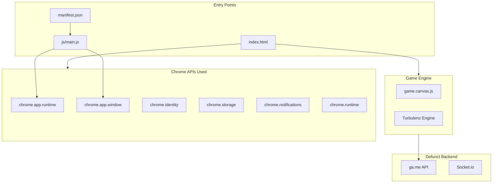

# PolyCRACK Game Restoration Plan

## Executive Summary

PolyCRACK is a Chrome Packaged App (Polycraft) built with AngularJS, Turbulenz engine, and Chrome extension APIs. The game host (ga.me) is shutdown. This plan covers: (1) running the app in NW.js, (2) adapting Chrome APIs, (3) deminifying code, and (4) enabling offline play without the backend.

---

## 1. Architecture Overview




---

## 2. Chrome API Usage - What Needs to Change


| File                                                     | Chrome API                                                                                          | NW.js Support                                       | Action                                                                                 |
| -------------------------------------------------------- | --------------------------------------------------------------------------------------------------- | --------------------------------------------------- | -------------------------------------------------------------------------------------- |
| [js/main.js](js/main.js)                                 | `chrome.app.runtime.onLaunched`, `chrome.app.window.create`, `chrome.runtime.onSuspend`             | Supported in NW.js Chrome Apps                      | **Minimal** - NW.js runs Chrome Apps directly; may need `package.json` for NW.js entry |
| [js/app/oauth.js](js/app/oauth.js)                       | `chrome.identity.getAuthToken`, `chrome.identity.removeCachedAuthToken`, `chrome.runtime.lastError` | Supported                                           | **None** - works in NW.js                                                              |
| [js/app/localstorage.js](js/app/localstorage.js)         | `chrome.storage.local.get/set`                                                                      | Supported                                           | **None**                                                                               |
| [js/app/badgeservice.js](js/app/badgeservice.js)         | `chrome.runtime.getURL`, `chrome.notifications.create`                                              | Supported                                           | **None**                                                                               |
| [js/app/paymentwindow.js](js/app/paymentwindow.js)       | `chrome.app.window.create`, `webview.executeScript`                                                 | Supported (webview tag in NW.js)                    | **None**                                                                               |
| [js/lib/googlewallet-buy.js](js/lib/googlewallet-buy.js) | `chrome.runtime.connect` to external extension                                                      | **Broken** - connects to Google Wallet extension ID | **Replace/Stub** - payments defunct; stub to no-op                                     |


**Key finding**: NW.js supports Chrome Apps and the `chrome.`* APIs used. The main adaptation is the **entry point**: Chrome Apps use `chrome.app.runtime.onLaunched`; NW.js typically loads `index.html` or a `package.json` main file directly.

---

## 3. NW.js Entry Point Strategy

**Option A - Run as Chrome App** (per [NW.js blog](https://nwjs.io/blog/chrome-apps-support/)):

```bash
/path/to/nw.exe <folder path of manifest.json>
```

Or drag the app folder onto the NW executable. The `manifest.json` must be in Chrome App format.

**Option B - Add package.json for NW.js**:
Create `package.json` alongside `manifest.json`:

```json
{
  "name": "polycraft",
  "main": "index.html",
  "window": {
    "min_width": 790,
    "min_height": 444,
    "width": 1280,
    "height": 720,
    "title": "Polycraft"
  }
}
```

Then run: `nw .` from the project root.

**Recommendation**: Use Option A first (run folder with manifest as Chrome App). If that fails, add `package.json` and use Option B.

---

## 4. Game Host (ga.me) - Offline Mode

The backend at `https://ga.me` is shutdown. The app already has **offline mode**:

- [js/app/online.js](js/app/online.js): `online.forceOffline()` + `navigator.onLine`
- [js/app/gamesessionservice.js](js/app/gamesessionservice.js): Uses `dummySessionId` when offline
- [js/app/sync.js](js/app/sync.js): On sync/API errors, forces offline and resolves so play continues
- [js/app/login.partial.html](js/app/login.partial.html): "play offline" button

**Required changes**:

1. **Default to offline**: On startup, if `ga.me` is unreachable, auto-route to offline play instead of blocking.
2. **Config service**: [js/app/config.js](js/app/config.js) fetches `/dynamic/config` - when offline with no cache, this fails. The socket service needs `config.msgserver.gadotmeurl` - only used when `socket.open()` is called (online path). For offline, socket is never opened.
3. **HTTP interceptor**: [js/app/app.js](js/app/app.js) lines 139-200 - when offline, uses `getFromCache()`. Empty cache rejects. Sync.test() catches errors and forces offline, so play continues.
4. **Login flow**: When offline, `$scope.play()` is called (from "play offline" or after OAuth failure). This forces offline and navigates to `/play` after 3 seconds.

**Minimal change**: Add a "Skip login / Play offline" shortcut on first load when `ga.me` is unreachable, or default `online.forceOffline()` on startup when backend is down. The existing "play offline" flow should work once we ensure the app loads.

---

## 5. Deminification Plan

### 5.1 [js/lib/googlewallet-buy.js](js/lib/googlewallet-buy.js) (2 lines, heavily minified)

**Current**: Connects to Chrome extension `nmmhkkegccagdldgiimedpiccmgmieda` (Google Wallet). Payments are defunct.

**Action**: Replace with a stub that exposes `window.google.payments.inapp.buy` as a no-op function that immediately calls `failure` callback:

```javascript
(function() {
  window.google = window.google || {};
  window.google.payments = window.google.payments || {};
  window.google.payments.inapp = window.google.payments.inapp || {};
  window.google.payments.inapp.buy = function(request) {
    if (request && request.failure) {
      request.failure({ request: {}, response: { errorType: 'SERVICE_UNAVAILABLE' } });
    }
  };
})();
```

### 5.2 [game.canvas.js](game.canvas.js) (6,231 lines, obfuscated)

**Nature**: Turbulenz engine + game logic. Obfuscated with short names (`Gj`, `Oc`, `eb`, `qi`, etc.). Contains:

- Math library (VMath - vectors, matrices, quaternions)
- A* pathfinding (from bgrins/javascript-astar)
- Physics, rendering, audio, input
- Game-specific logic (e.g. `lc` for terrain, `qi`/`ri` for grid nodes)

**Deminification options**:


| Approach                                   | Effort    | Risk   | Recommendation                                                                                                                        |
| ------------------------------------------ | --------- | ------ | ------------------------------------------------------------------------------------------------------------------------------------- |
| **Manual rename**                          | Very high | Low    | Only for critical paths (e.g. API calls to backend)                                                                                   |
| **Automated (e.g. prettier, js-beautify)** | Low       | Low    | Format only - improves readability, does not restore names                                                                            |
| **Source map**                             | N/A       | -      | No source map in repo                                                                                                                 |
| **Turbulenz open source**                  | Medium    | Medium | [turbulenz_engine](https://github.com/turbulenz/turbulenz_engine) exists; game.canvas.js is a built bundle - not directly replaceable |


**Recommendation**:

1. **Beautify** `game.canvas.js` with a formatter (prettier/js-beautify) for readability. This does not change behavior.
2. **Do not** attempt full deminification of the 6K-line engine - high effort, low payoff for "run the game."
3. **Search** `game.canvas.js` for any `ga.me`, `baseUrl`, or backend URLs - replace with configurable/local values if needed. From grep: the engine uses `TurbulenzEngine` (servicesDomain from bridge), `gameSessionId` in AJAX - these are injected by the host app, not hardcoded in game.canvas.js.

---

## 6. Webview Usage

- [index.html](index.html): `<webview id="login-webview" partition="persist:cookieshare">` - for OAuth/login redirect
- [js/app/paymentwindow.html](js/app/paymentwindow.html): `<webview id="webview">` - for payment flow
- [js/app/paymentwindow.js](js/app/paymentwindow.js): `webview.executeScript` for payment status

**NW.js**: Supports `<webview>` tag per [NW.js docs](https://docs.nwjs.io/en/latest/References/webview%20Tag/). No change needed for webview itself. Payment window will fail (backend down) - the stub for `google.payments.inapp.buy` handles that.

---

## 7. File-by-File Change Summary


| File                           | Changes                                                                                                                                                   |
| ------------------------------ | --------------------------------------------------------------------------------------------------------------------------------------------------------- |
| **manifest.json**              | Ensure `app.background.scripts` and permissions remain. Add `"node": true` if Node.js access needed (optional).                                           |
| **js/main.js**                 | If using package.json entry: may be bypassed. Consider creating `index.html` as main and moving window creation logic, or keep as-is for Chrome App mode. |
| **js/lib/googlewallet-buy.js** | Replace with stub (see Section 5.1).                                                                                                                      |
| **js/app/app.js**              | Optional: add startup logic to detect backend unreachable and auto-force offline.                                                                         |
| **package.json** (new)         | Create for NW.js if Chrome App mode fails.                                                                                                                |
| **game.canvas.js**             | Beautify only (optional). No functional changes required for offline.                                                                                     |


---

## 8. Implementation Order

1. **Create package.json** for NW.js with `main: "index.html"` and window config.
2. **Stub googlewallet-buy.js** to avoid crashes when store/payment is used.
3. **Test run** with `nw .` or by pointing NW.js at the app folder.
4. **If Chrome App mode**: Run `nw /path/to/PolyCRACK` (folder containing manifest.json).
5. **Optional**: Beautify game.canvas.js.
6. **Optional**: Add "Skip to play" / auto-offline on backend failure for smoother UX.

---

## 9. Verification Checklist

- App window opens in NW.js
- Login screen shows; "play offline" works
- Game canvas loads and renders
- No console errors from missing `chrome.`* APIs
- No errors from `google.payments.inapp.buy` when store is accessed
- Local storage (chrome.storage) persists between sessions
- Fullscreen works (webkitRequestFullscreen)

---

## 10. Risks and Mitigations


| Risk                                      | Mitigation                                                        |
| ----------------------------------------- | ----------------------------------------------------------------- |
| NW.js Chrome App mode differs from Chrome | Test early; fall back to package.json entry                       |
| OAuth fails in NW.js                      | Offline path does not require OAuth                               |
| game.canvas.js has hardcoded URLs         | Grep shows config comes from bridge; no hardcoded ga.me in engine |
| WebGL/WebGL2 compatibility                | NW.js uses Chromium; should match Chrome                          |


